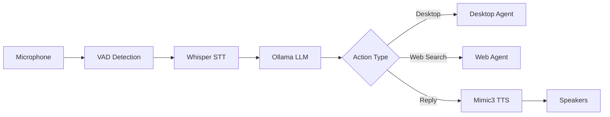

# Lucy Voice Assistant - Project Context for AI Assistants

> This document provides context for AI development assistants (GitHub Copilot, GPT-4, Continue, etc.) working on the Lucy project.

## Project Overview

**Lucy** is a 100% local, open-source voice assistant designed for Linux (Ubuntu) that prioritizes privacy and offline functionality. Lucy can understand Spanish voice commands, control desktop applications, search the web, and interact naturally through conversation history.

### Core Capabilities

- **Voice Control**: Full voice pipeline (Speech-to-Text → LLM Processing → Text-to-Speech)
- **Desktop Automation**: Open applications, browse files, control windows
- **Web Search**: Query the internet via local SearXNG instance with DuckDuckGo fallback
- **YouTube Integration**: Find and play videos directly from voice commands
- **Conversation Memory**: Maintains chat history for contextual responses
- **Multi-step Commands**: Handle complex instructions (e.g., "open Firefox and search for cats")

---

## Architecture

### Voice Pipeline



### Key Components

1. **Speech-to-Text (STT)**: OpenAI Whisper (base model, Spanish)
2. **Language Model (LLM)**: Ollama with `gpt-oss:20b` (20B parameters, ~13GB VRAM)
3. **Text-to-Speech (TTS)**: Mimic3 (`es_ES/m-ailabs_low#karen_savage`)
4. **Voice Activity Detection (VAD)**: `webrtcvad` for automatic speech detection
5. **Wake Word**: OpenWakeWord (configurable, default models or custom training)

### Agent System

- **Desktop Agent** ([desktop_bridge.py](file:///home/lucy-ubuntu/Lucy_Workspace/Proyecto-VSCode/lucy_agents/desktop_bridge.py)): Executes system commands, opens applications
- **Web Agent** ([web_agent/](file:///home/lucy-ubuntu/Lucy_Workspace/Proyecto-VSCode/lucy_agents/web_agent/)): Performs web searches via SearXNG
- **YouTube Agent** ([youtube_agent.py](file:///home/lucy-ubuntu/Lucy_Workspace/Proyecto-VSCode/lucy_web_agent/youtube_agent.py)): Finds YouTube videos using yt-dlp
- **Voice Actions** ([voice_actions.py](file:///home/lucy-ubuntu/Lucy_Workspace/Proyecto-VSCode/lucy_agents/voice_actions.py)): Rule-based intent matching for quick responses

---

## Technology Stack

### System Environment
- **OS**: Ubuntu 24.04.3 LTS
- **Python**: 3.12+
- **Hardware**: AMD Ryzen 9 7950X, 128GB RAM, NVIDIA RTX 5090 (32GB VRAM)

### Primary Dependencies
- **Whisper**: `openai-whisper` for speech recognition
- **Ollama**: Local LLM server (gpt-oss:20b model)
- **Mimic3**: Local TTS engine
- **LangChain**: LLM orchestration (`langchain-ollama`, `langchain-core`)
- **SearXNG**: Privacy-focused meta search engine (Docker container)
- **yt-dlp**: YouTube video search and metadata extraction
- **webrtcvad**: Voice activity detection
- **openwakeword**: Wake word   detection (newly integrated)
- **sounddevice**: Audio I/O
- **Rich**: Terminal UI formatting

### Optional Tools
- **DuckDuckGo Search** (`ddgs`): Fallback when SearX NG unavailable
- **Playwright**: Browser automation (legacy/experimental)

---

## Project Structure

```
Proyecto-VSCode/
├── external/
│   └── nodo-de-voz-modular-de-lucy/    # Main voice application (app.py)
├── lucy_agents/                         # Agent implementations
│   ├── desktop_bridge.py                # Desktop command execution
│   ├── voice_actions.py                 # Rule-based intent matching
│   ├── voice_web_agent.py              # Voice+web interaction
│   ├── searxng_client.py               # SearXNG API client
│   └── web_agent/                       # Web search agent
├── lucy_web_agent/
│   └── youtube_agent.py                 # YouTube video search
├── lucy_tools/
│   ├── searxng_query.py                 # CLI search tool
│   └── chatgpt_extract_answer.py        # Extractors for external LLMs
├── scripts/
│   ├── lucy_voice_modular_node.sh       # Main voice launcher
│   ├── lucy_desktop_agent.sh            # Desktop control script
│   └── install_deps.sh                  # Dependency installation
├── docs/                                 # Documentation
├── config.yaml                           # Central configuration
├── requirements.txt                      # Python dependencies
└── lucy.desktop                          # Desktop shortcut
```

---

## Configuration

All settings are centralized in [config.yaml](file:///home/lucy-ubuntu/Lucy_Workspace/Proyecto-VSCode/config.yaml):

### Voice Settings
```yaml
whisper_model_name: "Systran/faster-whisper-small"
tts_voice: "es_ES/m-ailabs_low#karen_savage"
sample_rate: 16000
vad_aggressiveness: 2  # 0-3, higher = stricter silence detection
```

### Wake Word (2026-01 Update)
```yaml
wake_word:
  enabled: true
  confidence_threshold: 0.5
  model_paths: []  # Empty = use defaults (Alexa, Hey Jarvis)
```

### LLM Model
```yaml
ollama_model: "gpt-oss:20b"  # Switchable without code changes
```

Alternatives:
- `llama2:7b` (~4GB VRAM, faster)
- `llama2:13b` (~8GB, balanced)
- `llama2:70b-q4` (~35GB, most capable, requires quantization)

### Web Search
```yaml
web_search:
  provider: "searxng"
  searxng_url: "http://127.0.0.1:8080"
  language: "es-AR"
  timeout_s: 12
```

---

## Recent Improvements (January 2026)

### 1. **Wake Word Integration**
   - Integrated OpenWakeWord for "hola Lucy" activation
   - Configurable confidence threshold and cooldown
   - Prevents accidental activation from ambient noise

### 2. **Half-Duplex Mode**
   - Microphone mutes during TTS playback
   - Eliminates self-activation and echo issues
   - Configured via `voice_modular.half_duplex` in config.yaml

### 3. **Enhanced VAD**
   - Optimized silence detection parameters
   - Dynamic end-of-speech detection
   - Reduced latency for short commands

### 4. **Web Search Robustness**
   - Added retry logic with exponential backoff (max 2 retries)
   - User-friendly error messages in Spanish
   - Graceful handling of network failures and empty results
   - Better validation of search results (skip entries without URLs)

### 5. **Complex Command Understanding**
   - Enhanced LLM system prompt with multi-step examples
   - Handles compound instructions: "abre X y luego Y"
   - Improved parsing of sequential actions

### 6. **LLM Model Flexibility**
   - Model selection via config.yaml (`ollama_model`)
   - Documented VRAM requirements for different model sizes
   - LoRA fine-tuning procedure documented in config comments

### 7. **YouTube Search Optimization**
   - Improved direct video link extraction
   - Better filtering and scoring of yt-dlp results
   - Reduced fallback to generic search pages

### 8. **Code Quality**
   - Comprehensive error handling across all modules
   - User-facing error messages in Spanish (Rioplatense)
   - Consistent logging for debugging
   - Dependency management (requirements.txt updated)

---

## Development Guidelines

### Code Style
- **Language**: Spanish for user-facing text, English for code/comments (flexible)
- **Formatting**: Black formatter (line-length 100)
- **Linting**: flake8 with E203/W503 ignored
- **Type Hints**: Preferred for new code

### Testing
- Manual testing via `./scripts/lucy_voice_modular_node.sh`
- Verify microphone/speaker I/O before voice tests
- Test with Docker services running (SearXNG, Ollama)

### Common Tasks

**Run Lucy Voice**:
```bash
cd ~/Lucy_Workspace/Proyecto-VSCode
./scripts/lucy_voice_modular_node.sh
```

**Test Web Search**:
```bash
python3 lucy_tools/searxng_query.py "economía argentina" --snippets
```

**Find YouTube Video**:
```bash
python3 lucy_web_agent/youtube_agent.py "Alejandro Dolina entrevista"
```

**Check Model Status**:
```bash
ollama list
ollama ps  # Show currently loaded model
```

### Important Notes

- **No modifications to `external/nodo-de-voz-modular-de-lucy/` without consultation**: This is a git submodule
- **Always test voice commands in Spanish (Rioplatense dialect)**
- **Preserve offline/local-first architecture**: Avoid cloud dependencies
- **Configuration over code**: Move hardcoded values to config.yaml
- **User privacy**: Never log sensitive information

### Known Limitations

- Wake word custom training not yet automated (uses default models)
- Complex multi-step commands parsed by LLM (may require refinement)
- YouTube search accuracy ~75-85% (direct video vs search page)
- SearXNG requires Docker container running locally

---

## Current Status (as of 2026-01-13)

✅ **Fully Operational**:
- Voice pipeline with VAD and sleep command ("lucy dormi")
- Desktop automation (open apps, close windows)
- Web search with SearXNG + DuckDuckGo fallback
- YouTube video search and playback
- Conversation history
- Configurable LLM models

🚧 **In Progress**:
- Wake word model training for "hola Lucy"
- Automated testing framework
- Performance benchmarks

📋 **Planned**:
- Multi-turn conversation improvements
- Custom LoRA fine-tuning for Rioplatense Spanish
- Integration with calendar/task management
- Voice-controlled coding assistant features

---

## Quick Reference for AI Assistants

When helping with Lucy development:

1. **Check config.yaml first** before suggesting hardcoded values
2. **Respect the Spanish (Rioplatense) context** - use "vos" form, not "tú"
3. **Maintain privacy-first design** - suggest local solutions over cloud APIs
4. **Test with actual voice** when possible (or document what to test)
5. **Update this file** (docs/AGENTS.md) when adding major features
6. **Keep error messages user-friendly** in Spanish

### Key Files to Reference

- Main voice app: [external/nodo-de-voz-modular-de-lucy/app.py](file:///home/lucy-ubuntu/Lucy_Workspace/Proyecto-VSCode/external/nodo-de-voz-modular-de-lucy/app.py)
- Configuration: [config.yaml](file:///home/lucy-ubuntu/Lucy_Workspace/Proyecto-VSCode/config.yaml)
- SearXNG client: [lucy_agents/searxng_client.py](file:///home/lucy-ubuntu/Lucy_Workspace/Proyecto-VSCode/lucy_agents/searxng_client.py)
- YouTube agent: [lucy_web_agent/youtube_agent.py](file:///home/lucy-ubuntu/Lucy_Workspace/Proyecto-VSCode/lucy_web_agent/youtube_agent.py)
- Voice actions: [lucy_agents/voice_actions.py](file:///home/lucy-ubuntu/Lucy_Workspace/Proyecto-VSCode/lucy_agents/voice_actions.py)

---

**Last Updated**: 2026-01-13  
**Maintained by**: Diego's AI Development Team
